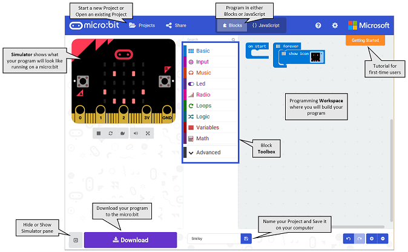
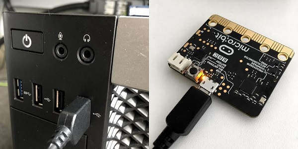
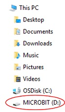

# micro:bit Software Overview
[Home](./)

## Power up your micro:bit for the first time

1. Plug in the USB cable to your PC and then into the top of your micro:bit.
1. The screen on your BBC micro:bit will slowly wake up with light patterns, and will then introduce itself. 
1. Follow the instructions and press the buttons as it asks. You will know you’ve done it right because the lights will display patterns.

## Tour of Microsoft MakeCode

We will be using the MakeCode code editor from Microsoft. 

* **Simulator**	 - on the left side of the screen, you will see a virtual micro:bit that will show what your program will look like running on a micro:bit. This is helpful for debugging, and instant feedback on program execution.
* **Toolbox** - in the middle of the screen, there are a number of different categories, each containing a number of blocks that can be dragged into the programming workspace on the right. 
* **Workspace** - on the right side of the screen is the Programming Workspace where you will create your program.  Programs are constructed by snapping blocks together in this area.

The color of the blocks identifies their category. All of the blocks that make up the program above come from the **Basic** Toolbox category, which is light blue.

## Downloading a MakeCode program to the micro:bit

To download the file to your micro:bit, you must connect it to your computer’s USB port using a micro-USB cable. The micro:bit will draw power from your computer through the USB connection, or you can connect an optional battery pack so it can function even after it is unplugged from the computer. Once plugged in, the micro:bit shows up on your computer like a USB flash drive.

Click the purple Download button in the lower left of the MakeCode screen. This will download the file to your computer, to the location where your browser is set to save downloads.

To move the program to your micro:bit, drag the downloaded "microbit-xxxx.hex" file to the MICROBIT drive, as if you were copying a file to a flash drive. The program will copy over, and it will begin running on the micro:bit immediately.

The micro:bit will hold one program at a time. It is not necessary to delete files off the micro:bit before you copy another onto the micro:bit; a new file will just replace the old one.

## Let's write some code

1. Start by going to [https://makecode.microbit.org/](https://makecode.microbit.org/). 

    > Tip: If you right click on the link above and open it in a "new window", you can use the alt + tab keyboard shortcut to flip between these instructions and your code editor.

1. In the upper right, click the orange "Getting Started" tutorial, and follow the instructions in the tutorial.
