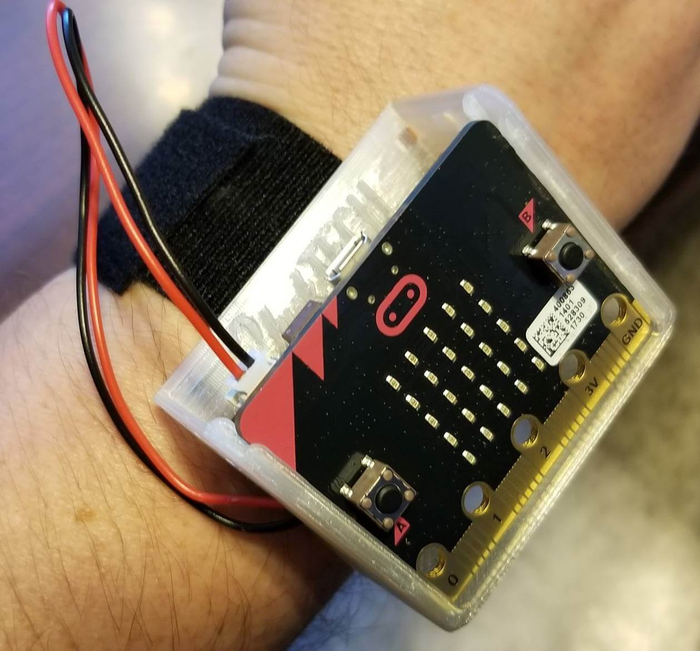

# Course Outline

## Overview
Coding a computer is not all sitting at a keyboard typing. In this hands on workshop we will use the BBC micro:bit and our creativity to make some wearable tech sure to be the fashion forward accessory of the year. The BBC micro:bit is a tiny programmable computer packed with a display, accelerometer, compass and more. Using Microsoft MakeCode a block based development environment we will learn some basic computer science skills while having fun making some custom creations with our micro:bit computer.  

## Take Home Item
BBC micro:bit maker kit and custom creation, a multi-funciton micro:bit watch

## Day 1 - 12/9 Fundamentals

1. **9:00 AM to 10:00 AM:** Career Panel
1. **10:00 AM to Noon:** Intro & Algorithms
    1. [Warmup](./010201_Warmup.html)
    1. [micro:bit Hardware](./010202_HardwareOverview.html)
    1. [micro:bit Software](./010203_SoftwareOverview.html)
    1. [Happy Face, Sad Face](./010204_HappySadFace.html)
    1. [Fidget:bit Challenge](./010205_FidgetBit.html)
1. **Noon to 1:00 PM:** Lunch
1. **1:00 PM to 2:00 PM:** 3d Printing
    1. [Using our 3d printer to make a watch frame](./010401_3dprinting.html)
1. **2:00 PM to 3:00 PM:** Variables
    1. [Overview](./010501_Variables.html)
    1. [Counter](./010502_Counter.html)
    1. [Scorekeeper Challenge](./010503_Scorekeeper.html)
1. **3:00 PM to 4:00 PM:** Conditional statements
    1. [Overview](./010601_Conditionals.html)
    1. [Rock, paper, scissors](./010602_RockPaperScissors.html)
    1. [micro:bit iPod Challenge](./010603_iPod.html)
1. **4:00 PM to 4:30 PM:** Day 1 Standup

## Day 2 - Project
1. 3:00 PM to 4:00 PM: Booleans
    1. [Overview](https://makecode.microbit.org/courses/csintro/booleans/overview)
    1. [Activity: Coin Flipper](https://makecode.microbit.org/projects/coin-flipper)
    1. [Project: Double Coin Flipper](https://makecode.microbit.org/courses/csintro/booleans/activity)
1. 10:00 AM to 11:00 AM: Iteration & Looping
    1. [Overview](https://makecode.microbit.org/courses/csintro/iteration/overview)
    1. [Activity: Traveling light](https://makecode.microbit.org/courses/csintro/iteration/activity)
    1. [Project: Compas](https://makecode.microbit.org/projects/compass)    
1. Noon to 1:00 PM: Lunch    
1. 1:00 PM to 3:30 PM: Watch
    1. [Digital Watch](https://makecode.microbit.org/projects/watch/digital-watch)

    1. [Project: Pedometer](https://makecode.microbit.org/courses/csintro/variables/project) [TWSU](https://make.techwillsaveus.com/bbc-microbit/activities/step-counter-by-the-faraday-institute)

## Bonus
> Time permitting
[twsu apple](https://make.techwillsaveus.com/bbc-microbit/activities/touch-arpeggiator)
[twsu resister](https://make.techwillsaveus.com/bbc-microbit/activities/micro-graphite-303)
[twsu morse phone](https://make.techwillsaveus.com/bbc-microbit/activities/micro-morse-phone)

1. [Projects from TechWillSaveUs.com](https://make.techwillsaveus.com/bbc-microbit/bit)
1. Radio
    1. [Overview](https://makecode.microbit.org/courses/csintro/radio)
    1. Activity Options: class will select from the list
        1. [micro:bit messenger](https://makecode.microbit.org/courses/csintro/radio/activity) - we will use a variation of the marco polo app to use the micro:bits in the watches to send messages to your friends
        1. [Rock Paper Scissors Teams](https://makecode.microbit.org/projects/rps-teams)
        1. [Infection](https://makecode.microbit.org/projects/infection)
        1. [Hot or Cold](https://makecode.microbit.org/projects/hot-or-cold)

